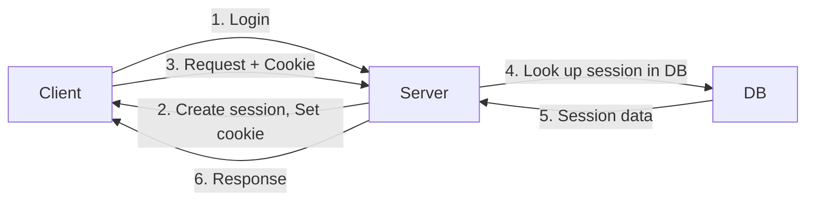
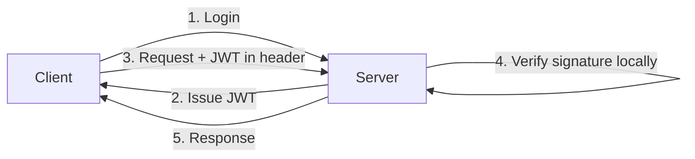

# 📋 Meta Information

- **date**: 2026/02/~
- **Training Module**: Authentication with JavaScript
- **Tag**: #FDETraining #Authentication #JavaScript #JWT #OAuth #Security
- **Related Notes**: [[materials/Authentication_JavaScript/app]]

---

## 🎯 Goal

- Understand **authentication vs authorization** and why they matter
- Implement **JWT (JSON Web Token)** based authentication
- Understand **session-based** vs **token-based** auth
- Know how to implement login flows securely
- Understand **OAuth 2.0** flow basics

---

## 📝 Summary

### Authentication vs Authorization

> Key Distinction

| Concept | Question | Example |
|---|---|---|
| **Authentication** | Who are you? | Login with email/password |
| **Authorization** | What can you do? | Admin can delete; user cannot |

---

### Session-Based vs Token-Based Auth

> Session-Based (Traditional)



- Session stored **server-side** (DB or memory)
- Client gets a **session ID** in a cookie
- ⚠️ Scales poorly (stateful — every server must access the session store)

> Token-Based (JWT)



- Token stored **client-side** (localStorage / httpOnly cookie)
- Server is **stateless** — no DB lookup needed
- ✅ Scales well (works across microservices)

---

### JWT (JSON Web Token)

> Structure

```
header.payload.signature

eyJhbGciOiJIUzI1NiJ9.eyJ1c2VyX2lkIjoiMTIzIn0.abc123...
```

| Part | Content | Encoded? |
|---|---|---|
| **Header** | Algorithm (`HS256`), type (`JWT`) | Base64URL |
| **Payload** | Claims (`user_id`, `exp`, `role`) | Base64URL |
| **Signature** | HMAC of header + payload + secret | Cryptographic |

> ⚠️ Payload is NOT encrypted — only signed. Never put passwords in JWT!

> Key Claims

```json
{
  "sub": "user_123",       // Subject (user ID)
  "role": "admin",
  "iat": 1706000000,       // Issued at
  "exp": 1706003600        // Expiration (1 hour later)
}
```

> Implementation (Node.js)

```javascript
const jwt = require("jsonwebtoken");
const SECRET = process.env.JWT_SECRET;

// Generate token
const token = jwt.sign(
  { userId: user.id, role: user.role },
  SECRET,
  { expiresIn: "1h" }
);

// Verify token
try {
  const decoded = jwt.verify(token, SECRET);
  console.log(decoded.userId);
} catch (err) {
  // Token invalid or expired
}
```

> Middleware Pattern

```javascript
function authMiddleware(req, res, next) {
  const token = req.headers.authorization?.split(" ")[1]; // "Bearer <token>"
  if (!token) return res.status(401).json({ error: "No token" });

  try {
    req.user = jwt.verify(token, SECRET);
    next();
  } catch {
    res.status(403).json({ error: "Invalid token" });
  }
}
```

---

### Password Security

> Hashing with bcrypt

```javascript
const bcrypt = require("bcryptjs");

// Hash password on register
const hashed = await bcrypt.hash(plainPassword, 10); // 10 = salt rounds

// Compare on login
const isMatch = await bcrypt.compare(plainPassword, hashed);
```

> ⚠️ Never store plaintext passwords. Always hash with a slow algorithm (bcrypt, argon2).

---

### OAuth 2.0 Basics

> What is OAuth?

A **delegation protocol** that lets users grant third-party apps limited access to their account without sharing passwords.

> Authorization Code Flow

```mermaid
flowchart LR
    User -->|1. Click "Login with Google"| App
    App -->|2. Redirect to Google| Google
    User -->|3. Approve| Google
    Google -->|4. Auth code| App
    App -->|5. Exchange code for token| Google
    Google -->|6. Access token| App
    App -->|7. Use token to get user info| GoogleAPI
```

> Common OAuth Providers

- Google (`accounts.google.com`)
- GitHub (`github.com/login/oauth`)
- Microsoft, Facebook, etc.

---

## ❓ Q&A

| Q | A | Clear? |
|---|---|---|
| JWT vs session? | JWT = stateless, scalable; Session = stateful, server-side storage | ☐ |
| Where to store JWT? | httpOnly cookie (safest) or memory; avoid localStorage (XSS risk) | ☐ |
| What is the salt in bcrypt? | Random value added before hashing to prevent rainbow table attacks | ☐ |

---

## 🔤 Word Memo

| Term | Definition | Notes |
|---|---|---|
| authentication | Verifying who you are | e.g. login with email/password |
| authorization | Verifying what you are allowed to do | e.g. admin vs regular user |
| JWT | JSON Web Token — a signed, stateless token | Header.Payload.Signature |
| hashing | One-way transformation (irreversible) | Used to store passwords safely |
| salt | Random value added to input before hashing | Prevents rainbow table attacks |
| OAuth | Open Authorization — delegation protocol | Used for "Login with Google" |
| middleware | Intermediate layer that processes requests | Runs before the route handler |

---

## ✅ Checklist

- [ ] Can you explain the 3 parts of a JWT?
- [ ] Can you hash a password with bcrypt?
- [ ] Can you explain the OAuth 2.0 Authorization Code Flow?

---

## 🔗 Graph Links

- 🗺️ MOC: [[MOC]]
- Prev → [[materials/Pyspark/Pyspark]]
- Next → [[materials/MongoDB_FastAPI/MongoDB_FastAPI]]
- Related Lecture → [[Lecture/day28-Securing LLMs & Guardrails/Securing LLMs & Guardrails]]

### Notes with overlapping concepts
- Security & Guardrails → [[Lecture/day28-Securing LLMs & Guardrails/Securing LLMs & Guardrails]]
- `#concept/input-guardrail` → [[Lecture/day28-Securing LLMs & Guardrails/Securing LLMs & Guardrails]]

### Capstone connection
- Auth Service → [[Captone/README]]

---

## 🏷️ Tags

`#type/practice` `#domain/security`
`#concept/authentication` `#concept/jwt` `#concept/oauth`
`#concept/bcrypt` `#concept/middleware`
`#status/reviewed`
