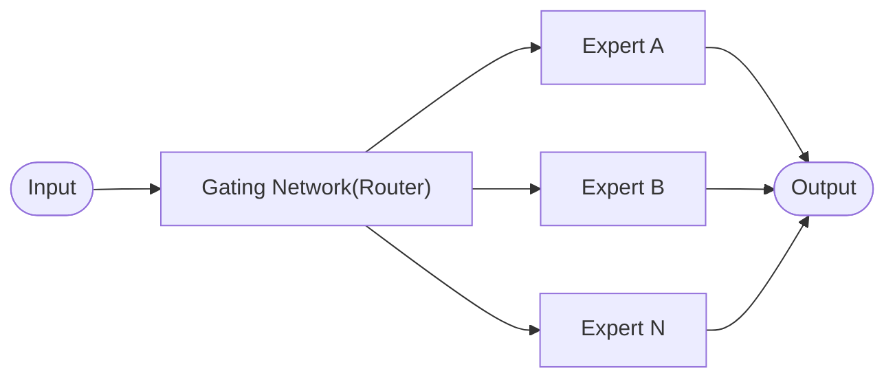
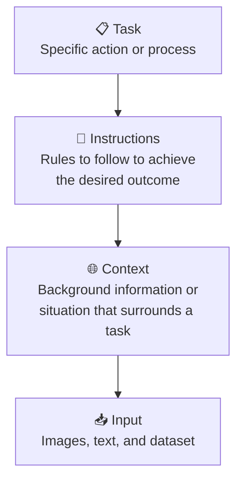

# 📋 Meta Information
- **date**: 2026/02/23
- **Training Module**: History of Generative AI
- **Tag**: #FDE研修 #Transformer #LLM #OpenRouter #MoE #PromptEngineering
- **Related Notes**: [[Lesson_01_Getting_Started_with_GenAI.pdf]] [[Lesson_02_Optimizing_GenAI_Models.pdf]] 

---

# 🎯 Goal
> By the end of this lesson, you will be able to:
- Identify the applications of Generative AI in solving real-world problems
- Create prompts to communicate effectively with Gen AI tools for desired outcomes
- Apply Generative AI tools to create personalized documents such as resumes or conduct research
- Use powerful GPTs, such as Write For Me, Canva AI, Designate GPT, Consensus, and Universal Primer, to explore diverse Gen AI capabilities for various Tasks

---

# 📝 Summary

## 1. Introduction To Generative AI

> LLM
 
- Large ... Models learned by using a lot of data.
- Language ... Human can use
- Model ... Use like mathematics  or mechanism

>Llama

It is used ecosystem in Meta services

>Open Router

We can use a lot of LLM models in Open Router.
Its output is compatible with Open AI formats.

>Important understanding  

- Parameter
Not Open Source LLM (Chat GPT, Claude, Gemini, ...) hidden Parameters.
Someone assumes 2trillion between 10 trillion.

- Token 
Token is not equal words. For example, it contains specific character.
Token is very important concept because It relates to our cost directly.
The cost has changed.

- Context Window
The range of text which LLM can see at once.
unit = token
It contains Input and Output

|モデル|Context Window|
|---|---|
|GPT-3|4,096 tokens|
|GPT-4|128,000 tokens|
|Claude 3.5|200,000 tokens|
|Gemini 1.5|1,000,000 tokens|

> One Hot Encoding

Change Sentences to One-Hot Vector

> Attention Mechanism

To give a clear example, consider translation. Within the decoder, it selects the word with the closest meaning for each word.

>Mixture of Expert

Instead of using all experts, the Router selects only the Top-K experts per input. 
This allows increasing parameters while keeping computation cost low.

- **Router**: Calculates weights via softmax, activates only Top-K experts
- **Sparse Activation**: Most experts are not computed (parameters exist but inactive)
- **Used in**: GPT-4, Mixtral, Gemini 1.5, etc.

## 2. Prompt Engineering

### Category in Prompt

> Four important components that make up a great prompt:

>Task

Specific action or process you want the AI to perform.

>Instructions

Rules to follow to achieve the desired outcome.

>Context

Background information or situation that surrounds the task.

>Input

Images, text, or dataset provided to the AI.

### Methods

>Zero-shot learning

Ask the model to perform a task with no examples at all. The model relies entirely on its pre-trained knowledge.

- e.g. `"Translate this sentence to French: ..."`

>One-shot learning

Provide exactly one example before the actual task. Helps the model understand the expected format or style.

- e.g. `"Q: What is 2+2? A: 4. Now, Q: What is 5+3? A:"`

>Few-shot learning

Provide a small number of examples (typically 2–5) before the task. More reliable than zero/one-shot for complex or domain-specific outputs.

- e.g. Provide 3 sample sentiment labels, then ask the model to label a new sentence.

>Chain-of-thought prompting

Guide the model to reason step-by-step rather than jumping to a final answer. Encourages more accurate and thoughtful responses on complex tasks.

- e.g. `"Think step by step: If a train travels 60 mph for 2 hours..."`

>Self-consistency prompting

Ask the same question multiple times (with slight variation) and take the most frequent answer. Reduces randomness and improves reliability.

- e.g. Ask `"What is the capital of France?"` repeatedly → consistent answer = Paris.

>Tree-of-thought prompting

The model explores multiple reasoning paths (branches) for a problem, evaluates each, and selects the best. Useful for multi-step or strategic problems.

- e.g. For a logic puzzle, generate 3 different solution paths and pick the most valid one.

>Classification prompting

Prompt the model to assign an input into one of predefined categories. Works well with zero-shot or few-shot examples.

- e.g. `"Classify the following review as Positive, Negative, or Neutral: ..."`

>Least-to-most prompting

Break a complex problem into smaller sub-problems and solve them from simplest to most complex sequentially. Each answer feeds into the next.

- e.g. To solve a multi-step math problem, first solve each component separately, then combine.

# district

### Attention
[[https://proceedings.neurips.cc/paper_files/paper/2017/file/3f5ee243547dee91fbd053c1c4a845aa-Paper.pdf | Attention Is All You Need]]

> Embedding 

 Text to Vector.

>Positional Encoding

Since Transformers process tokens in parallel (not sequentially), they have no sense of word order by default. Positional Encoding adds position information to each token's embedding so the model knows where each word appears in the sequence.

- Represented as a vector added to the embedding vector
- Uses sine/cosine functions at different frequencies

>Multi-Head Attention

Runs the attention mechanism multiple times in parallel with different learned weight matrices ("heads"). Each head can focus on different aspects of the relationships between tokens (e.g. syntax, semantics). The outputs are concatenated and projected.

- Allows the model to attend to information from different representation subspaces simultaneously

>Add & Norm

A residual connection (Add) followed by Layer Normalization (Norm), applied after each sub-layer (Attention or Feed Forward).

- **Add**: `output = sublayer(x) + x` — preserves the original input to prevent vanishing gradients
- **Norm**: Normalizes the summed output to stabilize training

>Feed Forward

A simple position-wise fully connected network applied independently to each token after the attention step. Consists of two linear transformations with a ReLU activation in between.

- `FFN(x) = max(0, xW₁ + b₁)W₂ + b₂`
- Adds non-linearity and transforms the representation

>Masked Multi-Head Attention

Same as Multi-Head Attention, but used in the **Decoder**. A mask is applied to prevent each token from attending to future tokens (tokens that haven't been generated yet). Ensures the model generates output auto-regressively.

- Also called **Causal Self-Attention**
- e.g. When generating word 3, the model can only see words 1 and 2

### Mixture of Experts(MoE)
[**A Visual Guide to Mixture of Experts](https://newsletter.maartengrootendorst.com/p/a-visual-guide-to-mixture-of-experts)
[**Switch Transformer](https://arxiv.org/abs/2101.03961)
[**NVIDIA技術ブログ** Mixtral 8x7B](https://developer.nvidia.com/blog/applying-mixture-of-experts-in-llm-architectures/)
[A Survey on MoE in LLMs](https://arxiv.org/abs/2407.06204)

---

## ❓ Q&A

| Q   | A   | Clear？ |
| --- | --- | ------ |
|     |     | ☐      |
|     |     | ☐      |
|     |     | ☐      |

---

## 🔤 Word Memo

| English | Japanese | Addition |
| ------- | -------- | -------- |
|         |          |          |
|         |          |          |
|         |          |          |

---

## 🔗 links

- Knowledge before you know: [[]]
- Related Concept: [[]]
- Implement Memo: [[]]

---

## ✅ Checklist

- [ ] explain one sentences each point?
- [ ] Are you able to explain it?
- [ ] Can you be specific?

### Review Notes
> Write notes What you notice when you review the today's lecture

---

## 💡 Summary（Write after lecture）
> Write your understanding

