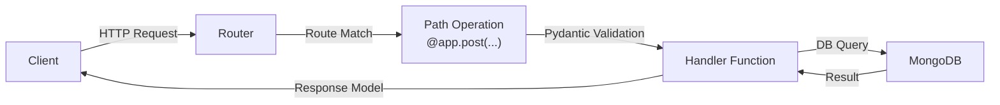

# 📋 Meta Information

- **date**: 2026/02/~
- **Training Module**: FastAPI + MongoDB / NoSQL Backend Development
- **Tag**: #FDETraining #FastAPI #MongoDB #NoSQL #REST #Python
- **Related Notes**: [[materials/MongoDB_FastAPI/day7_assignment]] [[materials/MongoDB_FastAPI/day8_assignment]]

---

## 🎯 Goal

- Understand the **FastAPI** framework and how to build REST APIs with Python
- Understand **MongoDB** as a NoSQL document database and how it differs from SQL
- Connect FastAPI to MongoDB using motor (async) or pymongo
- Implement CRUD operations via HTTP endpoints
- Understand schema design in NoSQL (embedding vs referencing)

---

## 📝 Summary

### FastAPI

> What is FastAPI?

A modern, high-performance Python web framework for building APIs, based on standard Python type hints.

- Built on **Starlette** (ASGI) and **Pydantic** (data validation)
- Auto-generates **OpenAPI docs** at `/docs` and `/redoc`
- Supports **async/await** natively → ideal for I/O-bound workloads

> Key Components

- **Router** — organizes endpoints by resource (`APIRouter`)
- **Path Operations** — `@app.get()`, `@app.post()`, `@app.put()`, `@app.delete()`
- **Pydantic Models** — define request/response schemas with type validation
- **Dependency Injection** — `Depends()` for shared logic (auth, DB connections)

> Request/Response Flow



> FastAPI vs Flask

| Feature | FastAPI | Flask |
|---|---|---|
| Type hints | ✅ Native | ❌ Manual |
| Async support | ✅ Built-in | ⚠️ Limited |
| Auto docs | ✅ OpenAPI | ❌ Manual |
| Performance | ⚡ High (ASGI) | 🐢 WSGI |
| Learning curve | Medium | Low |

---

### MongoDB

> What is MongoDB?

A **document-oriented NoSQL** database that stores data as BSON (Binary JSON) documents.

- No fixed schema → flexible, evolving data models
- Scales horizontally via **sharding**
- Native support for nested documents and arrays

> Core Concepts

| Concept | SQL Equivalent | MongoDB |
|---|---|---|
| Database | Database | Database |
| Table | Table | **Collection** |
| Row | Row | **Document** |
| Column | Column | **Field** |
| Primary Key | Primary Key | **`_id`** (ObjectId) |

> Document Example

```json
{
  "_id": "ObjectId('abc123')",
  "name": "Yuichi",
  "role": "FDE",
  "skills": ["FastAPI", "MongoDB", "Python"],
  "address": {
    "city": "Tokyo",
    "district": "Shibuya"
  }
}
```

> Schema Design: Embedding vs Referencing

- **Embedding** — nest related data inside the same document
  - ✅ Fast reads (single query)
  - ⚠️ Document size limit (16MB), data duplication
  - Best for: 1:few relationships (user → addresses)

- **Referencing** — store `_id` of related document (like a foreign key)
  - ✅ Normalized, no duplication
  - ⚠️ Requires multiple queries or `$lookup`
  - Best for: 1:many or many:many (order → products)

> Key MongoDB Operations

```python
# Insert
await collection.insert_one({"name": "item"})

# Find
doc = await collection.find_one({"_id": id})

# Update
await collection.update_one({"_id": id}, {"$set": {"status": "active"}})

# Delete
await collection.delete_one({"_id": id})
```

> Indexing

- `_id` is indexed by default
- Create indexes for frequently queried fields: `collection.create_index("email")`
- **Compound index**: index on multiple fields for complex queries

---

### FastAPI + MongoDB Integration

> Connection Pattern (Motor - async)

```python
from motor.motor_asyncio import AsyncIOMotorClient

client = AsyncIOMotorClient("mongodb://localhost:27017")
db = client["mydb"]
collection = db["users"]
```

> CRUD Endpoint Pattern

```python
@router.post("/users", response_model=UserResponse)
async def create_user(user: UserCreate):
    result = await collection.insert_one(user.dict())
    return await collection.find_one({"_id": result.inserted_id})
```

> ObjectId Handling

MongoDB uses `ObjectId` which is not directly JSON-serializable. Must convert:

```python
from bson import ObjectId

def str_to_objectid(id: str) -> ObjectId:
    return ObjectId(id)
```

---

## ❓ Q&A

| Q | A | Clear? |
|---|---|---|
| When to use embedding vs referencing? | Embed for 1:few (fast read); reference for 1:many (normalize) | ☐ |
| Why async with MongoDB? | Avoids blocking I/O — critical for high-concurrency APIs | ☐ |
| How does FastAPI validate input? | Pydantic models — raises 422 if types don't match | ☐ |

---

## 🔤 Word Memo

| Term | Definition | Notes |
|---|---|---|
| endpoint | The URL that receives an API request | e.g. `POST /users` |
| schema | Structure definition of data | Enforced by Pydantic |
| embedding | Nesting related data inside the same document | Faster reads, but duplicates data |
| referencing | Pointing to another document via `_id` | Like a foreign key in SQL |
| sharding | Horizontally splitting data across nodes | For horizontal scaling |
| CRUD | Create / Read / Update / Delete | Core DB operations |

---

## ✅ Checklist

- [ ] Can you implement CRUD endpoints from scratch?
- [ ] Can you explain when to use embedding vs referencing?
- [ ] Can you explain FastAPI's Dependency Injection?

---

## 🔗 Graph Links

- 🗺️ MOC: [[MOC]]
- Prev → [[materials/Authentication_JavaScript/Authentication_JavaScript]]
- Next → [[materials/ReactFirstStep/ReactFirstStep]]
- Related Lecture → [[Lecture/day23-SemanticSearch/System Architecture & Semantic Search]]
- Capstone connection → [[Captone/README]] (Auth / Product / Cart / Order Service)

### Notes with overlapping concepts
- `#concept/nosql` theory → [[Lecture/day23-SemanticSearch/System Architecture & Semantic Search]]
- `#concept/microservices` → [[Lecture/day23-SemanticSearch/System Architecture & Semantic Search]]

### Practice using these skills
- Day7 Assignment → [[materials/MongoDB_FastAPI/day7_assignment]]
- Day8 Assignment → [[materials/MongoDB_FastAPI/day8_assignment]]

---

## 🏷️ Tags

`#type/practice` `#domain/system-design`
`#concept/fastapi` `#concept/mongodb` `#concept/nosql`
`#concept/rest-api` `#concept/crud` `#concept/async`
`#status/reviewed`
