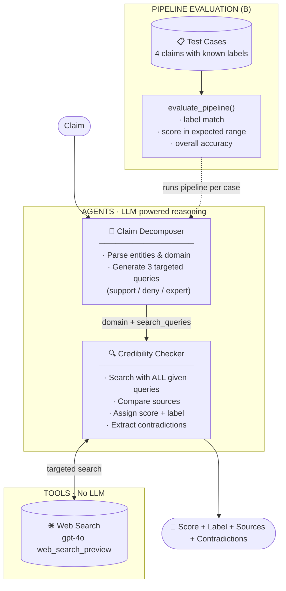
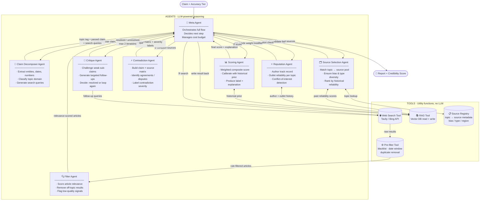

# Task 5 · Multi-Source News Credibility Checker

---

## Current Architecture (step1_eval)

The implemented architecture at the current stage. Two-agent structure.



### Current limitations

| Not yet implemented | Impact |
| ------------------- | ------ |
| Source Scoring | All sources have equal weight |
| Reputation Agent | Author and outlet reliability not considered |
| Contradiction Agent | Contradiction detection is shallow, embedded in Checker |
| Critique Loop | No re-search even when evidence is weak |
| RAG / Source Registry | No historical calibration |

---

## Target Architecture (Full Multi-Agent)

The ideal architecture to work toward. Seven agents + four tools.



---

## Separation of Concerns

| Type | Component | Role | Status |
| ---- | --------- | ---- | ------ |
| **Agent** | Meta Agent | Full orchestration, cost management, next-step decision | Not implemented |
| **Agent** | Claim Decomposer | Claim understanding, topic classification, query generation | ✅ step1_eval |
| **Agent** | Source Selection | Select sources per topic, ensure diversity | Not implemented |
| **Agent** | Filter Agent | LLM-level relevance scoring | Not implemented |
| **Agent** | Reputation Agent | Evaluate author and outlet reliability history | Not implemented |
| **Agent** | Contradiction Agent | Cross-source comparison, contradiction severity labeling | Not implemented |
| **Agent** | Critique Agent | Challenge weak claims, drive re-search loop | Not implemented |
| **Agent** | Scoring Agent | Final score aggregation, historical calibration | Not implemented |
| **Tool** | Web Search Tool | External API call (returns raw data only) | ✅ step1_eval (web_search_preview) |
| **Tool** | Pre-filter Tool | Rule-based filter (blacklist, date window, deduplication) | Not implemented |
| **Tool** | RAG Tool | Vector DB read/write (historical memory) | Not implemented |
| **Tool** | Source Registry | Topic → source metadata, static/semi-static config | Not implemented |

---

## Key Design Principles

### Agents vs Tools

- Tools never reason — pure I/O functions
- Agents never call APIs directly — always go through a Tool
- Meta Agent owns flow control — individual Agents only return results

### Role of RAG

Source Selection, Reputation, and Scoring Agents all reference historical memory.
Past scores, per-source reliability, and known contradiction patterns are used for calibration.

### Critique Loop

The Critique Agent is the only Agent that can trigger a re-search loop.
Cuts off at max 2 iterations or cost limit reached, marking the result as `UNRESOLVED`.

---

## Implementation Roadmap

```text
✅ minimal_mvp   — single agent, 1 LLM call
✅ step1_eval    — Claim Decomposition + Pipeline Evaluation
⬜ step2         — Source Scoring (individual score per source)
⬜ step3         — Contradiction Detection (cross-source comparison)
⬜ step4         — Scoring Agent (weighted composite)
⬜ full          — Meta Agent + all components integrated
```

---

## Open Questions

- [ ] RAG backend: ChromaDB (local) vs Pinecone (managed)
- [ ] Reputation data source: internal DB vs Media Bias/Fact Check API vs skip?
- [ ] Source Registry update frequency: static config vs LLM-driven periodic updates?
- [ ] Critique Loop trigger: always / low-confidence only / user choice?
- [ ] Cost management granularity: token limit / time limit / per-claim budget?
