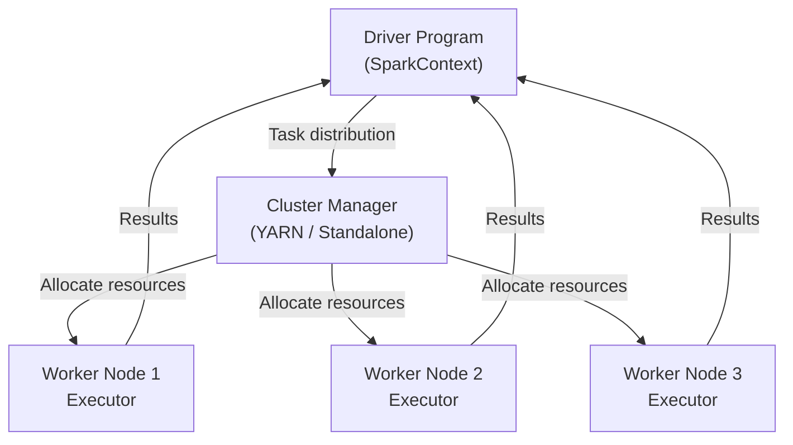

# 📋 Meta Information

- **date**: 2026/02/~
- **Training Module**: PySpark — Distributed Data Processing
- **Tag**: #FDETraining #PySpark #BigData #DataPipeline #Spark #Python
- **Related Notes**: [[materials/Pyspark/day14-assignment]] [[materials/Pyspark/day16-assignment]]

---

## 🎯 Goal

- Understand **Apache Spark** architecture and why it's used for big data
- Write **PySpark** code to transform and analyze large datasets
- Understand **RDD vs DataFrame** API
- Build data transformation pipelines using PySpark
- Understand lazy evaluation and the execution model

---

## 📝 Summary

### What is Apache Spark?

> Overview

A **distributed computing framework** for processing large-scale data in parallel across a cluster.

- **In-memory processing** → much faster than Hadoop MapReduce (disk-based)
- Supports: batch processing, streaming, ML (MLlib), graph (GraphX), SQL
- PySpark = Python API for Apache Spark

> Why Spark?

| Scenario | Tool |
|---|---|
| Small data (<1GB) | Pandas |
| Medium data (1-10GB) | Pandas / Dask |
| Large data (10GB+) | **PySpark** |
| Real-time streaming | Spark Streaming / Kafka |

---

### Spark Architecture



> Key Concepts

| Concept | Description |
|---|---|
| **Driver** | Main program, creates SparkContext, orchestrates jobs |
| **Executor** | Worker process that runs tasks on each node |
| **Task** | Smallest unit of work, runs on a partition |
| **Partition** | Chunk of data distributed across workers |
| **Stage** | Group of tasks that can run in parallel |
| **Job** | A complete computation triggered by an action |

---

### RDD vs DataFrame

> RDD (Resilient Distributed Dataset)

- Low-level, distributed collection of objects
- Type-safe but verbose
- Useful for unstructured data or custom transformations

```python
rdd = sc.parallelize([1, 2, 3, 4, 5])
result = rdd.filter(lambda x: x > 2).map(lambda x: x * 2).collect()
# [6, 8, 10]
```

> DataFrame (Recommended)

- High-level, tabular (like pandas/SQL)
- Optimized by **Catalyst optimizer**
- Best for structured/semi-structured data

```python
from pyspark.sql import SparkSession

spark = SparkSession.builder.appName("MyApp").getOrCreate()
df = spark.read.csv("data.csv", header=True, inferSchema=True)
df.show()
```

---

### Key DataFrame Operations

> Transformations (Lazy — don't execute until action)

```python
# Select columns
df.select("name", "age")

# Filter rows
df.filter(df.age > 25)

# Add / transform columns
from pyspark.sql.functions import col, upper
df.withColumn("name_upper", upper(col("name")))

# Group and aggregate
df.groupBy("department").agg({"salary": "avg", "id": "count"})

# Join
df1.join(df2, on="user_id", how="inner")

# Sort
df.orderBy("salary", ascending=False)
```

> Actions (Trigger execution)

```python
df.show()          # Print rows
df.count()         # Row count
df.collect()       # Bring all data to driver (⚠️ careful with large data)
df.write.parquet("output/")   # Save to file
```

---

### Lazy Evaluation

> How it works

Spark does **not** execute transformations immediately. It builds a **DAG** (Directed Acyclic Graph) of operations and only executes when an **action** is called.

```mermaid
flowchart LR
    Read["read CSV"] --> Filter["filter(age > 25)"] --> Select["select(name, dept)"] --> GroupBy["groupBy(dept)"] --> Agg["agg(count)"]
    Agg -->|Action: show()| Execute["⚡ Execute DAG"]
```

> Benefits

- Spark can **optimize** the whole pipeline before running
- Avoids unnecessary computation
- Enables pipelining across stages

---

### Data Pipeline Pattern

```python
from pyspark.sql import SparkSession
from pyspark.sql.functions import col, avg

spark = SparkSession.builder.appName("SalesPipeline").getOrCreate()

# Extract
df = spark.read.parquet("s3://data/sales/")

# Transform
result = (
    df
    .filter(col("status") == "completed")
    .withColumn("revenue", col("quantity") * col("price"))
    .groupBy("product_id")
    .agg(avg("revenue").alias("avg_revenue"))
    .orderBy("avg_revenue", ascending=False)
)

# Load
result.write.mode("overwrite").parquet("s3://output/sales_summary/")

spark.stop()
```

---

## ❓ Q&A

| Q | A | Clear? |
|---|---|---|
| RDD vs DataFrame? | RDD = low-level, flexible; DataFrame = high-level, SQL-optimized, faster | ☐ |
| What is lazy evaluation? | Transformations build a plan; actions trigger execution | ☐ |
| When to use `.collect()`? | Only on small results — brings ALL data to driver | ☐ |

---

## 🔤 Word Memo

| Term | Definition | Notes |
|---|---|---|
| partition | A chunk of data assigned to one worker | Unit of parallelism in Spark |
| executor | The worker process that runs tasks | Lives on each worker node |
| lazy evaluation | Transformations are not executed until an action is called | Enables pipeline optimization |
| DAG | Directed Acyclic Graph — the execution plan Spark builds | Visualizable in Spark UI |
| action | An operation that triggers actual computation | e.g. `show()`, `count()`, `collect()` |
| transformation | A lazy operation that defines a new dataset | e.g. `filter()`, `groupBy()` |

---

## ✅ Checklist

- [ ] Can you explain Spark's architecture with a diagram?
- [ ] Can you explain the difference between transformations and actions?
- [ ] Can you write `groupBy` + `agg` from scratch?

---

## 🔗 Graph Links

- 🗺️ MOC: [[MOC]]
- Prev → [[materials/Pytest_JEST/Pytest_JEST]]
- Next → [[materials/Authentication_JavaScript/Authentication_JavaScript]]
- Practice files → [[materials/Pyspark/day14-assignment]] / [[materials/Pyspark/day16-assignment]]

### Notes with overlapping concepts
- System Architecture (distributed systems) → [[Lecture/day23-SemanticSearch/System Architecture & Semantic Search]]

### Capstone connection
- Data pipeline / LLM Ops → [[Captone/README]]

---

## 🏷️ Tags

`#type/practice` `#domain/data-engineering`
`#concept/spark` `#concept/pyspark` `#concept/data-pipeline`
`#concept/distributed-computing` `#concept/lazy-evaluation`
`#status/reviewed`
