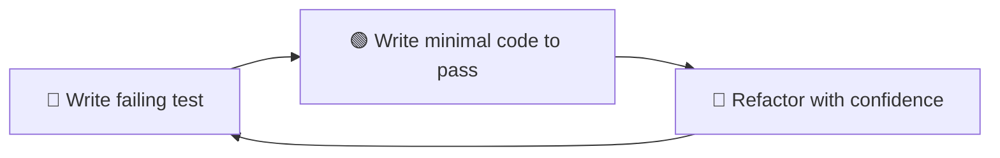

# 📋 Meta Information

- **date**: 2026/02/~
- **Training Module**: Testing — Pytest (Python) & JEST (JavaScript)
- **Tag**: #FDETraining #Testing #Pytest #JEST #TDD #QualityAssurance
- **Related Notes**: [[materials/Pytest_JEST/day12_assignment]] [[materials/Pytest_JEST/day13_assignment]]

---

## 🎯 Goal

- Understand the **purpose and value** of automated testing
- Write unit tests in **Pytest** for Python backend code
- Write unit tests in **JEST** for JavaScript/React frontend code
- Understand **mocking** and how to isolate units under test
- Apply **TDD** (Test-Driven Development) thinking

---

## 📝 Summary

### Why Testing?

> The Testing Pyramid

```
        /\
       /  \
      / E2E\        ← Few, slow, expensive (Selenium, Cypress)
     /------\
    /Integrat\      ← Medium (API tests, DB integration)
   /----------\
  /  Unit Tests \   ← Many, fast, cheap (Pytest, JEST)
 /______________\
```

> Types of Tests

| Type | Scope | Tool | Speed |
|---|---|---|---|
| **Unit** | Single function/component | Pytest, JEST | ⚡ Fast |
| **Integration** | Multiple units together | Pytest, Supertest | 🏃 Medium |
| **E2E** | Full user flow | Cypress, Playwright | 🐢 Slow |

---

### Pytest (Python)

> Basic Structure

```python
# test_calculator.py
def add(a, b):
    return a + b

def test_add():
    assert add(2, 3) == 5

def test_add_negative():
    assert add(-1, -1) == -2
```

> Running Tests

```bash
pytest                    # Run all tests
pytest test_file.py       # Run specific file
pytest -v                 # Verbose output
pytest -k "test_add"      # Run tests matching keyword
```

> Fixtures

Fixtures provide reusable setup for tests:

```python
import pytest

@pytest.fixture
def sample_user():
    return {"id": 1, "name": "Yuichi", "role": "FDE"}

def test_user_name(sample_user):
    assert sample_user["name"] == "Yuichi"
```

> Parametrize

Test multiple inputs with one function:

```python
@pytest.mark.parametrize("a, b, expected", [
    (1, 2, 3),
    (0, 0, 0),
    (-1, 1, 0),
])
def test_add(a, b, expected):
    assert add(a, b) == expected
```

> Mocking with `unittest.mock`

```python
from unittest.mock import patch, MagicMock

def test_api_call():
    with patch("mymodule.requests.get") as mock_get:
        mock_get.return_value.json.return_value = {"status": "ok"}
        result = fetch_status()
        assert result == "ok"
```

> Testing FastAPI Endpoints

```python
from fastapi.testclient import TestClient
from main import app

client = TestClient(app)

def test_get_users():
    response = client.get("/users")
    assert response.status_code == 200
    assert isinstance(response.json(), list)
```

---

### JEST (JavaScript)

> Basic Structure

```javascript
// calculator.test.js
const { add } = require("./calculator");

test("adds two numbers", () => {
  expect(add(2, 3)).toBe(5);
});

test("adds negatives", () => {
  expect(add(-1, -1)).toBe(-2);
});
```

> Running Tests

```bash
npx jest                    # Run all tests
npx jest --watch            # Watch mode
npx jest calculator.test    # Run specific file
```

> Common Matchers

```javascript
expect(value).toBe(5)              // strict equality
expect(value).toEqual({a: 1})      // deep equality
expect(value).toBeTruthy()
expect(value).toContain("item")
expect(fn).toThrow()
```

> Mocking

```javascript
// Mock a module
jest.mock("./api");
import { fetchUser } from "./api";
fetchUser.mockResolvedValue({ name: "Yuichi" });

// Mock a function
const mockFn = jest.fn();
mockFn.mockReturnValue(42);
expect(mockFn()).toBe(42);
expect(mockFn).toHaveBeenCalledTimes(1);
```

> Testing React Components (React Testing Library)

```javascript
import { render, screen, fireEvent } from "@testing-library/react";
import Counter from "./Counter";

test("increments counter on click", () => {
  render(<Counter />);
  const button = screen.getByText("+");
  fireEvent.click(button);
  expect(screen.getByText("Count: 1")).toBeInTheDocument();
});
```

---

### TDD — Test-Driven Development

> The Red-Green-Refactor Cycle



> Benefits

- Forces you to think about the interface **before** implementation
- Provides a safety net for refactoring
- Acts as living documentation

---

## ❓ Q&A

| Q | A | Clear? |
|---|---|---|
| When to mock? | When the real dependency is slow, flaky, or has side effects (DB, APIs) | ☐ |
| Unit vs integration test? | Unit = isolate one function; Integration = test units working together | ☐ |
| What is a fixture? | Reusable setup data/objects shared across tests | ☐ |

---

## 🔤 Word Memo

| Term | Definition | Notes |
|---|---|---|
| assertion | A statement that checks an expected value | e.g. `assert x == 5` |
| fixture | Reusable test setup data or objects | Defined with `@pytest.fixture` |
| mock | A fake replacement for a real dependency | Isolates the unit under test |
| parametrize | Running the same test with multiple inputs | `@pytest.mark.parametrize` |
| coverage | How much of the code is exercised by tests | Measured as a percentage |
| TDD | Test-Driven Development — write tests before code | Red → Green → Refactor |

---

## ✅ Checklist

- [ ] Can you write Pytest tests using fixtures?
- [ ] Can you test React components with JEST?
- [ ] Can you isolate external dependencies using mocks?

---

## 🔗 Graph Links

- 🗺️ MOC: [[MOC]]
- Prev → [[materials/React_pagenation/React_Pagination]]
- Next → [[materials/Pyspark/Pyspark]]
- Practice files → [[materials/Pytest_JEST/day12_assignment]] / [[materials/Pytest_JEST/day13_assignment]]

### Notes with overlapping concepts
- Evaluation / Quality Gate → [[Lecture/day29-GenAI System Eva & Framework/GenAI System Evaluation & Framework]]
- LLM Eval & QA → [[Lecture/day30-LLM Eval & Quality Assurance/LLM Eval & Quality Assurance]]

### Capstone connection
- Eval / Quality Gate → [[Captone/README]]

---

## 🏷️ Tags

`#type/practice` `#domain/testing`
`#concept/pytest` `#concept/jest` `#concept/mocking`
`#concept/tdd` `#concept/unit-test`
`#status/reviewed`
