# 📦 materials — Index

This folder contains **hands-on assignments and practice implementations** from the FDE training program (Days 1–20 and applied AI tasks).  
Each subfolder has a dedicated note summarizing what was learned, key concepts, and connections to Lectures and the Capstone.

---

## 🗺️ Folder Map

```mermaid
flowchart TD
    MAT["materials/"]
    MAT --> AUTH["Authentication_JavaScript</br>JWT · OAuth · bcrypt · Middleware"]
    MAT --> MONGO["MongoDB_FastAPI</br>FastAPI · MongoDB · CRUD · Async"]
    MAT --> R1["ReactFirstStep</br>JSX · Props · State · Hooks"]
    MAT --> R2["React_pagenation</br>Pagination · Client/Server-side"]
    MAT --> R3["React_assessment</br>Week 3 Assessment · Product Catalog App"]
    MAT --> TEST["Pytest_JEST</br>Unit Test · Mock · TDD · Fixture"]
    MAT --> SPARK["Pyspark</br>Spark · RDD · DataFrame · Lazy Eval"]
    MAT --> LLM["Orchestrated LLM Application</br>Multi-Agent · LLM-as-Judge · RAG"]
    MAT --> MCP["day28-activity</br>MCP Server · stdio · JSON-RPC"]
    MAT --> INTRO["Introduction AI and Prompt Engineering</br>GenAI · Prompt Engineering"]
```

---

## 📋 Notes Index

| Folder | Note | Topic | Related Lecture |
|---|---|---|---|
| `Authentication_JavaScript/` | [[materials/Authentication_JavaScript/Authentication_JavaScript]] | JWT, OAuth 2.0, bcrypt, Middleware | [[Lecture/day28-Securing LLMs & Guardrails/Securing LLMs & Guardrails]] |
| `MongoDB_FastAPI/` | [[materials/MongoDB_FastAPI/MongoDB_FastAPI]] | FastAPI, MongoDB, CRUD, async | [[Lecture/day23-SemanticSearch/System Architecture & Semantic Search]] |
| `ReactFirstStep/` | [[materials/ReactFirstStep/ReactFirstStep]] | React basics, JSX, Props, useState | [[Lecture/day23-SemanticSearch/System Architecture & Semantic Search]] |
| `React_pagenation/` | [[materials/React_pagenation/React_Pagination]] | Pagination, client/server-side | — |
| `React_assessment/` | [[materials/React_assessment/React_Assessment]] | Week 3 assessment, Product Catalog App | — |
| `Pytest_JEST/` | [[materials/Pytest_JEST/Pytest_JEST]] | Pytest, JEST, mocking, TDD | [[Lecture/day29-GenAI System Eva & Framework/GenAI System Evaluation & Framework]] |
| `Pyspark/` | [[materials/Pyspark/Pyspark]] | PySpark, DataFrame, lazy evaluation | [[Lecture/day23-SemanticSearch/System Architecture & Semantic Search]] |
| `Orchestrated LLM Application/` | [[materials/Orchestrated LLM Application/Task5_Orchestrated_LLM]] | Multi-Agent, LLM-as-Judge, RAG pipeline | [[Lecture/day24-FDE skills & LLM Orchestration/LLM Orchestration]], [[Lecture/day26-Agentic AI & RAG/Agentic AI & RAG]] |
| `day28-activity/` | [[materials/day28-activity/Day28_MCP_Activity]] | MCP Server, stdio, JSON-RPC | [[Lecture/day27-Agent Protocols & Advanced Use Cases/Agent Protocols & Advanced Use Cases]] |
| `Introduction AI and Prompt Engineering/` | [[materials/Introduction AI and Prompt Engineering/Introduction To GenAI & Prompt Engineering]] | GenAI, Prompt Engineering | [[Lecture/day21-Introduction AI and Prompt Engineering/Introduction To GenAI & Prompt Engineering]] |

---

## 🔗 Graph Links

- 🗺️ MOC → [[MOC]]
- Lecture folder → [[Lecture/README]]
- Capstone → [[Captone/README]]

---

## 🏷️ Tags

`#type/index` `#folder/materials`
