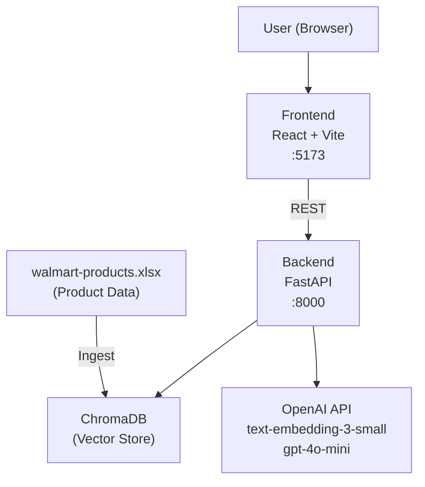
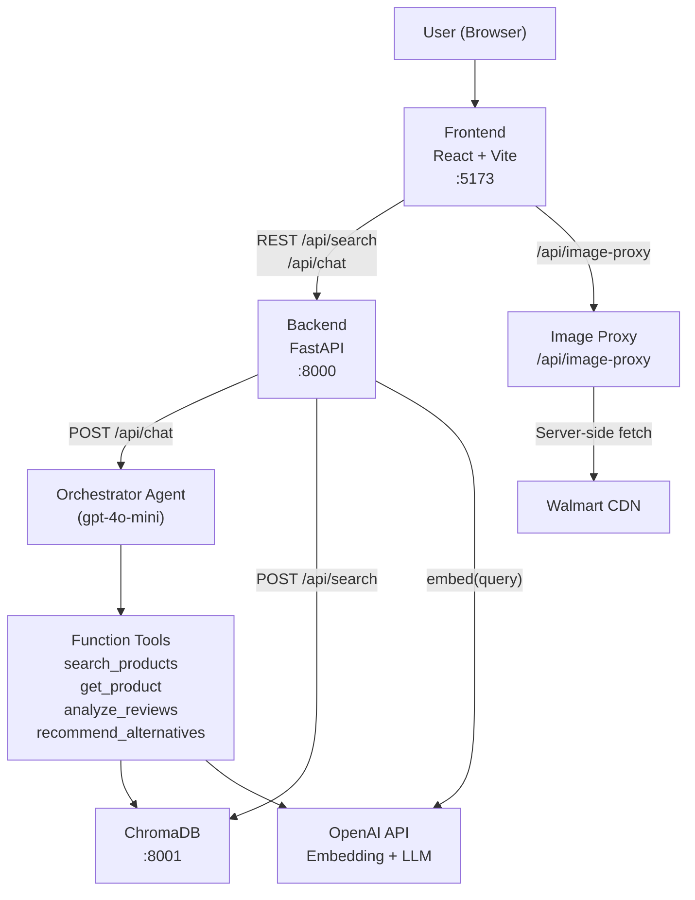
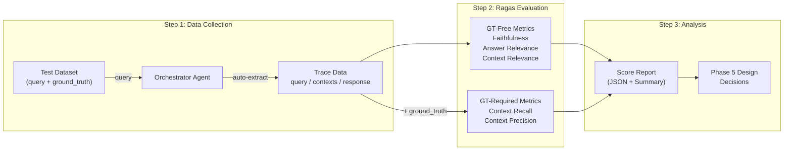
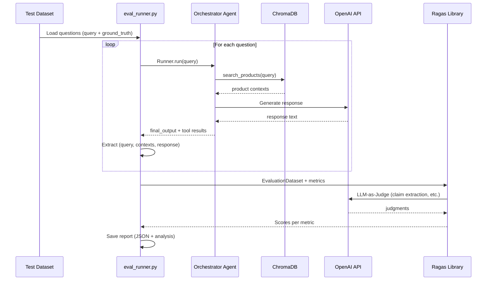
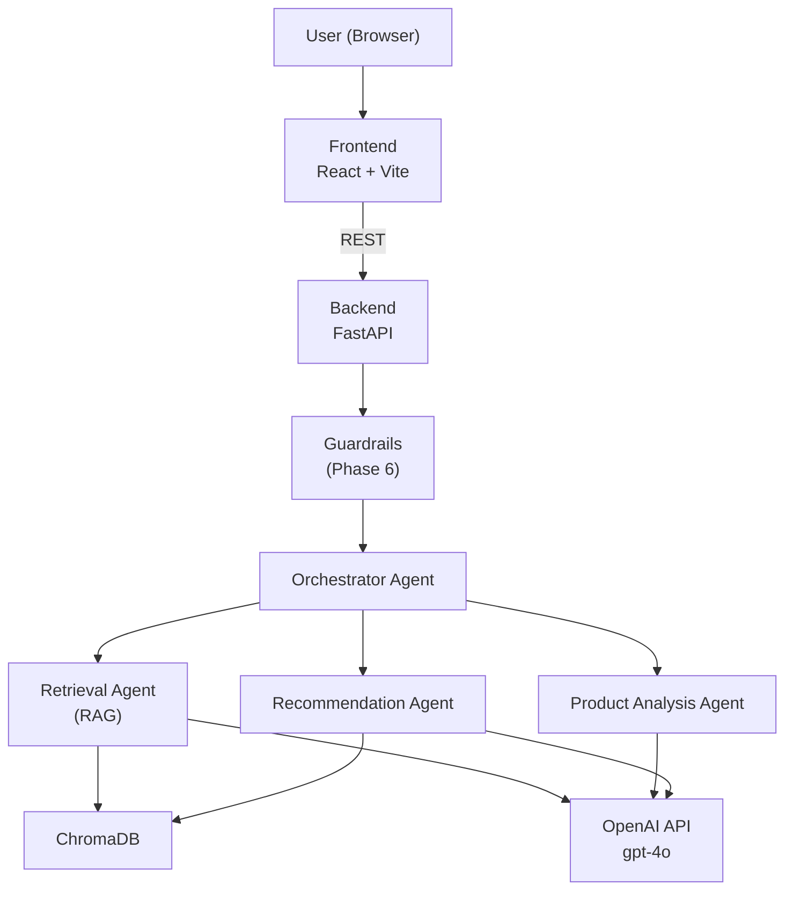
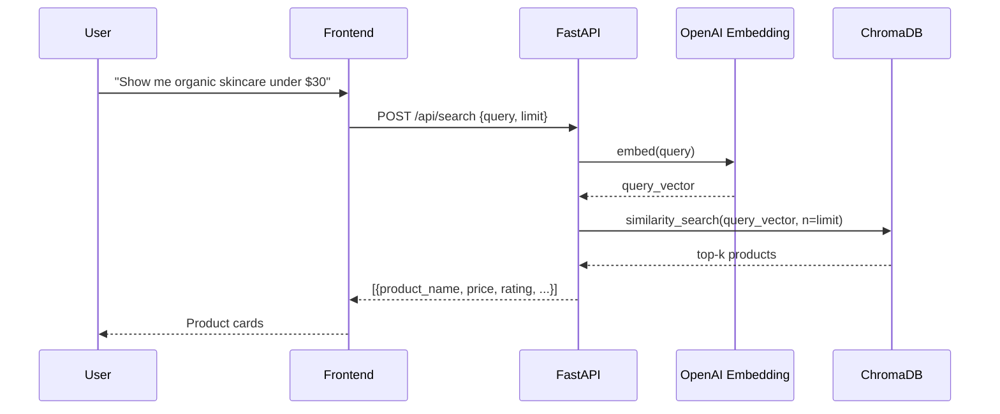
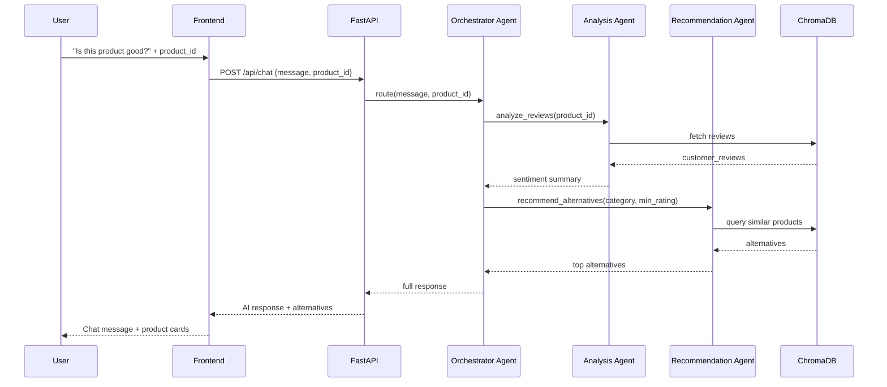

# System Architecture

## Current Architecture (Phase 1–2: No Agents)

## Current Architecture (Phase 3: Single Agent MVP)

## Phase 4: Evaluation Pipeline

## Phase 4: Evaluation Data Flow

## Target Architecture (Phase 5: Multi-Agent)

## API Endpoints (Phase 1 target)

| Method | Path | Description |
| ------ | ---- | ----------- |
| POST | `/api/search` | Natural language product search (RAG) |
| GET | `/api/products/{product_id}` | Get product detail by ID |
| POST | `/api/chat` | Product chatbot (placeholder in Phase 1) |
| GET | `/api/health` | Health check |

> Agent-backed endpoints (`/api/chat`, `/api/recommend`) return stub responses in Phase 1–2
> and are connected to real agents in Phase 3+.

## Data Flow: Product Search

## Data Flow: Chatbot (Phase 3+)

