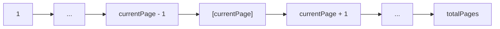

# 📋 Meta Information

- **date**: 2026/02/~
- **Training Module**: React — Pagination & List Management
- **Tag**: #FDETraining #React #JavaScript #Pagination #UX #Frontend
- **Related Notes**: [[materials/React_pagenation/day11_assignment]]

---

## 🎯 Goal

- Understand the concept and UX purpose of **pagination**
- Implement client-side pagination with React state
- Understand how to slice data arrays for display
- Handle page navigation (prev / next / jump to page)
- Apply pagination to real datasets (products, search results, etc.)

---

## 📝 Summary

### Why Pagination?

> Problem with Long Lists

Rendering hundreds or thousands of items at once causes:
- Slow initial render (DOM overload)
- Poor UX (users can't scan long lists)
- High memory usage

> Solutions

| Approach | Technique | Use Case |
|---|---|---|
| **Pagination** | Show N items per page, navigate pages | Tables, search results |
| **Infinite Scroll** | Load more as user scrolls | Social feeds |
| **Virtual List** | Only render visible items in DOM | Very large datasets |

---

### Client-Side Pagination

> Core Logic

```jsx
const ITEMS_PER_PAGE = 10;

// Derived values
const totalPages = Math.ceil(items.length / ITEMS_PER_PAGE);
const startIndex = (currentPage - 1) * ITEMS_PER_PAGE;
const currentItems = items.slice(startIndex, startIndex + ITEMS_PER_PAGE);
```

> Full Example

```jsx
import { useState } from "react";

function PaginatedList({ items }) {
  const [currentPage, setCurrentPage] = useState(1);
  const itemsPerPage = 10;

  const totalPages = Math.ceil(items.length / itemsPerPage);
  const start = (currentPage - 1) * itemsPerPage;
  const pageItems = items.slice(start, start + itemsPerPage);

  return (
    <div>
      <ul>
        {pageItems.map(item => <li key={item.id}>{item.name}</li>)}
      </ul>
      <div>
        <button
          onClick={() => setCurrentPage(p => Math.max(p - 1, 1))}
          disabled={currentPage === 1}
        >
          Prev
        </button>
        <span>{currentPage} / {totalPages}</span>
        <button
          onClick={() => setCurrentPage(p => Math.min(p + 1, totalPages))}
          disabled={currentPage === totalPages}
        >
          Next
        </button>
      </div>
    </div>
  );
}
```

---

### Server-Side Pagination

> When to Use

Client-side pagination works for small datasets loaded at once. For large datasets, use **server-side pagination** — only fetch the current page's data.

> API Pattern

```
GET /api/products?page=2&limit=10
```

```json
{
  "data": [...],
  "total": 150,
  "page": 2,
  "limit": 10,
  "totalPages": 15
}
```

> React with Server-Side Pagination

```jsx
useEffect(() => {
  fetchProducts(currentPage, itemsPerPage).then(setData);
}, [currentPage]);
```

---

### Page Number Display

> Showing Page Numbers

```jsx
const pageNumbers = Array.from({ length: totalPages }, (_, i) => i + 1);

{pageNumbers.map(num => (
  <button
    key={num}
    onClick={() => setCurrentPage(num)}
    className={num === currentPage ? "active" : ""}
  >
    {num}
  </button>
))}
```

> Truncating Large Page Ranges

For many pages, show: `1 ... 4 5 [6] 7 8 ... 20`



---

## ❓ Q&A

| Q | A | Clear? |
|---|---|---|
| Client vs server-side pagination? | Client = slice local array; Server = fetch only page's data from API | ☐ |
| How to reset page on filter change? | `setCurrentPage(1)` whenever filter/search state changes | ☐ |
| Why `Math.ceil` for totalPages? | 11 items with 10/page = 1.1 → ceil = 2 pages | ☐ |

---

## 🔤 Word Memo

| Term | Definition | Notes |
|---|---|---|
| pagination | Splitting content across multiple navigable pages | Core UX pattern for long lists |
| offset | The starting position when slicing a list | `(page - 1) * itemsPerPage` |
| slice | Extracting a portion of an array | `array.slice(start, end)` |
| truncate | Shortening a long page range with `...` | UX improvement for many pages |
| infinite scroll | Automatically loading more items as the user scrolls | Alternative to pagination |

---

## ✅ Checklist

- [ ] Can you implement client-side pagination from scratch?
- [ ] Can you adapt `useEffect` for server-side pagination?
- [ ] Can you reset the page number when a filter changes?

---

## 🔗 Graph Links

- 🗺️ MOC: [[MOC]]
- Prev → [[materials/ReactFirstStep/ReactFirstStep]]
- Next → [[materials/Pytest_JEST/Pytest_JEST]]
- Practice files → [[materials/React_pagenation/day11_assignment]]

### Notes with overlapping concepts
- React basics → [[materials/ReactFirstStep/ReactFirstStep]]
- React comprehensive assessment → [[materials/React_assessment/React_Assessment]]

### Capstone connection
- Product listing UI (pagination) → [[Captone/README]]

---

## 🏷️ Tags

`#type/practice` `#domain/frontend`
`#concept/react` `#concept/pagination` `#concept/ux`
`#concept/state-management`
`#status/reviewed`
