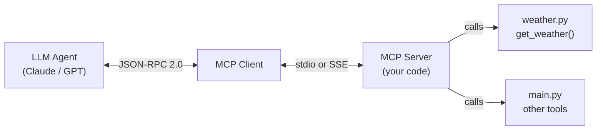

# 📋 Meta Information

- **date**: 2026/02/~
- **Training Module**: MCP Server Implementation — Agent Protocols
- **Tag**: #FDETraining #MCP #AgentProtocols #Python #Tools
- **Related Notes**: [[Lecture/day27-Agent Protocols & Advanced Use Cases/Agent Protocols & Advanced Use Cases]]

---

## 🎯 Goal

- Implement a real **MCP (Model Context Protocol) server** in Python
- Expose tools (functions) that an LLM agent can call via MCP
- Understand the **stdio transport** pattern for local MCP servers
- Connect a custom MCP server to an agent framework

---

## 📝 Summary

### What is MCP?

> Overview

**Model Context Protocol** — an open standard (by Anthropic) that defines how LLM agents communicate with external tools and data sources.

- Standardizes the **Tool / Resource / Prompt** interface
- Separates the LLM from tool implementation → swappable, reusable servers
- Transport options: **stdio** (local), **SSE** (remote/HTTP)

> MCP Architecture



> MCP vs Direct Tool Calling

| Aspect | Direct Tool | MCP Server |
|---|---|---|
| Discovery | Hardcoded in agent | Dynamic (list_tools) |
| Reusability | One agent only | Any MCP-compatible client |
| Language | Same as agent | Any (Python, JS, etc.) |
| Deployment | In-process | Separate process / server |

---

### This Activity: Weather MCP Server

> Files

```
day28-activity/
├── main.py       ← MCP server entry point
└── weather.py    ← Weather tool implementation
```

> `weather.py` — Tool Implementation

```python
import httpx

async def get_weather(city: str) -> dict:
    """Get current weather for a city using Open-Meteo API."""
    # Geocoding → get lat/lon
    geo_url = f"https://geocoding-api.open-meteo.com/v1/search?name={city}"
    async with httpx.AsyncClient() as client:
        geo_resp = await client.get(geo_url)
        data = geo_resp.json()
    
    lat = data["results"][0]["latitude"]
    lon = data["results"][0]["longitude"]
    
    # Weather fetch
    weather_url = (
        f"https://api.open-meteo.com/v1/forecast"
        f"?latitude={lat}&longitude={lon}"
        f"&current_weather=true"
    )
    async with httpx.AsyncClient() as client:
        resp = await client.get(weather_url)
    
    return resp.json()["current_weather"]
```

> `main.py` — MCP Server

```python
from mcp.server import Server
from mcp.server.stdio import stdio_server
from mcp.types import Tool, TextContent
from weather import get_weather

app = Server("weather-server")

@app.list_tools()
async def list_tools() -> list[Tool]:
    return [
        Tool(
            name="get_weather",
            description="Get current weather for a city",
            inputSchema={
                "type": "object",
                "properties": {
                    "city": {"type": "string", "description": "City name"}
                },
                "required": ["city"]
            }
        )
    ]

@app.call_tool()
async def call_tool(name: str, arguments: dict):
    if name == "get_weather":
        result = await get_weather(arguments["city"])
        return [TextContent(type="text", text=str(result))]

async def main():
    async with stdio_server() as (read, write):
        await app.run(read, write, app.create_initialization_options())

if __name__ == "__main__":
    import asyncio
    asyncio.run(main())
```

---

### MCP Core Concepts

> Three Primitives

| Primitive | Description | Example |
|---|---|---|
| **Tools** | Functions the LLM can call | `get_weather`, `search_web` |
| **Resources** | Data/files the LLM can read | Files, DB records, API responses |
| **Prompts** | Reusable prompt templates | System prompt templates |

> JSON-RPC 2.0 Protocol

MCP uses **JSON-RPC 2.0** for communication:

```json
// Request: client → server
{
  "jsonrpc": "2.0",
  "id": 1,
  "method": "tools/call",
  "params": {
    "name": "get_weather",
    "arguments": { "city": "Tokyo" }
  }
}

// Response: server → client
{
  "jsonrpc": "2.0",
  "id": 1,
  "result": {
    "content": [{ "type": "text", "text": "15°C, clear sky" }]
  }
}
```

> Transport Layers

| Transport | Use Case | How |
|---|---|---|
| **stdio** | Local tools, CLI | stdin/stdout pipes |
| **SSE** | Remote/HTTP servers | Server-Sent Events |
| **WebSocket** | Bidirectional streaming | Future support |

---

## ❓ Q&A

| Q | A | Clear？ |
|---|---|---|
| MCP vs direct function calling? | MCP = standardized, discoverable, reusable across clients | ☐ |
| Why stdio transport for local? | Simple process communication — no network needed | ☐ |
| What is `list_tools`? | Advertises available tools so the LLM client can discover them dynamically | ☐ |

---

## 🔤 Word Memo

| English | Japanese | Addition |
|---|---|---|
| MCP | モデルコンテキストプロトコル | LLMとツール間の標準プロトコル |
| stdio | 標準入出力 | プロセス間通信の最もシンプルな方法 |
| JSON-RPC | JSON遠隔手続き呼び出し | JSON形式のRPC規格 |
| SSE | サーバー送信イベント | HTTP経由のサーバーからのストリーム |
| primitive | プリミティブ | MCPの基本構成要素 (Tools/Resources/Prompts) |

---

## ✅ Checklist

- [ ] MCPサーバーをゼロから実装できる？
- [ ] list_toolsとcall_toolの役割を説明できる？
- [ ] stdio vs SSEの違いを説明できる？

---

## 🔗 Graph Links

- 🗺️ MOC: [[MOC]]
- Related Lecture → [[Lecture/day27-Agent Protocols & Advanced Use Cases/Agent Protocols & Advanced Use Cases]]
- MCP理論 → [[Lecture/day27-Agent Protocols & Advanced Use Cases/Agent Protocols & Advanced Use Cases]]

### 同じ概念を持つノート
- `#concept/mcp` の理論 → [[Lecture/day27-Agent Protocols & Advanced Use Cases/Agent Protocols & Advanced Use Cases]]
- `#concept/tool-calling` → [[Lecture/day25-LangChain/LLM Orchestration with LangChain]]
- `#concept/agent-loop` → [[Lecture/day26-Agentic AI & RAG/Agentic AI & RAG]]

### Capstone との接続
- Multi-Agent × MCP → [[Captone/README]]

---

## 🏷️ Tags

`#type/practice` `#domain/mcp` `#domain/agent`
`#concept/mcp` `#concept/json-rpc` `#concept/transport-layer`
`#concept/tool-calling` `#concept/stdio` `#concept/sse`
`#status/reviewed`
